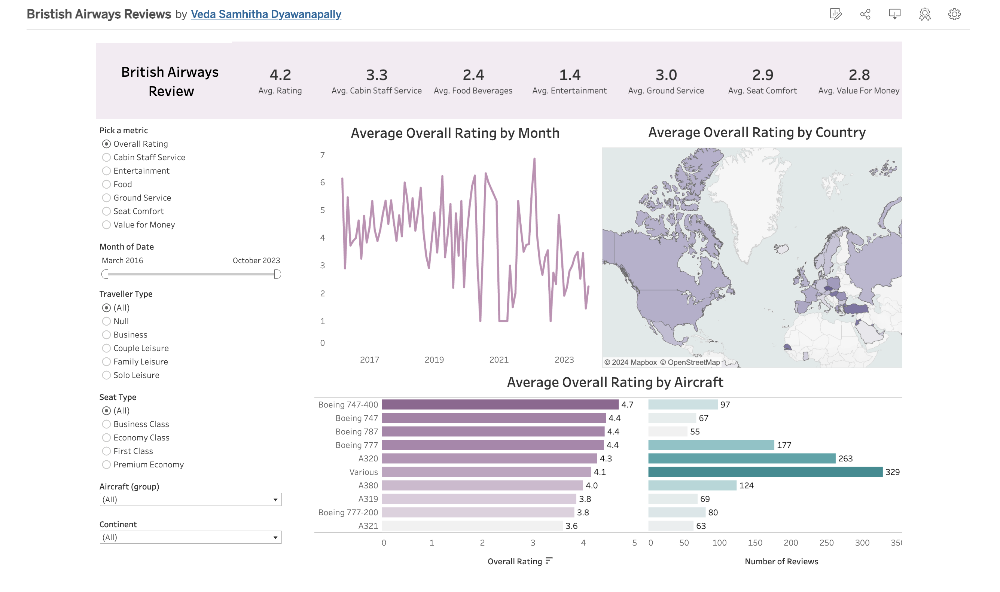

# ✈️ British Airways Customer Satisfaction Analysis

## Overview 📊
This repository contains a detailed customer satisfaction analysis for British Airways, presented through an interactive Tableau dashboard. The analysis covers various metrics such as overall rating, cabin staff service, food, entertainment, ground service, seat comfort, and value for money.

## Data Visualization 📈
The dashboard provides insights into British Airways' performance over time and across different dimensions:
- 📅 Average Overall Rating by Month
- 🌍 Average Overall Rating by Country
- ✈️ Average Overall Rating by Aircraft

## Interactive Components 🔧
Users can interact with the dashboard to filter results based on:
- 📆 Month and Year
- 👤 Traveller Type (Business, Couple Leisure, Family Leisure, Solo Leisure)
- 🛏️ Seat Type (Economy, Business Class, First Class, Premium Economy)
- 🛩️ Aircraft Type
- 🌐 Continent

## Key Findings 🔑
- The highest-rated aircraft based on customer reviews is the Boeing 747-400.
- Food 🍲 and entertainment 🎬 services have lower satisfaction scores compared to other services.

## Screenshot 📸

## Tableau Public Link 🔗
You can interact with the live dashboard on Tableau Public at the following link:
[Tableau Dashboard](https://public.tableau.com/views/BristishAirwaysReviews/Dashboard1?:language=en-US&publish=yes&:sid=&:display_count=n&:origin=viz_share_link)

## Acknowledgements 💡
- British Airways for providing the data.
- All the customers who took the time to leave a review.
- Learnt this Analysis from a Youtuber:[Mo-Chen](https://www.youtube.com/channel/UCDybamfye5An6p-j1t2YMsg), Thank You!
